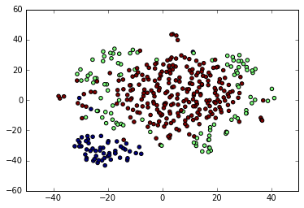
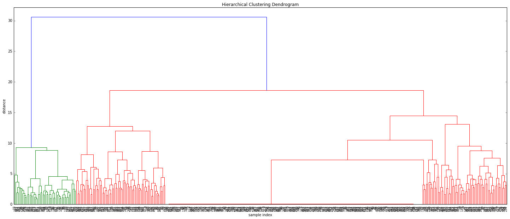

# passwords_anaysis

analysis of 500-worst passwords list

vectorization was done by simple look-up in an existing word list

then PCA was performed before feeding the result to t-SNE

clustering was performed on pca data, t-sne was used only for visualization

the algorithm was able to distinguish name from other passwords

